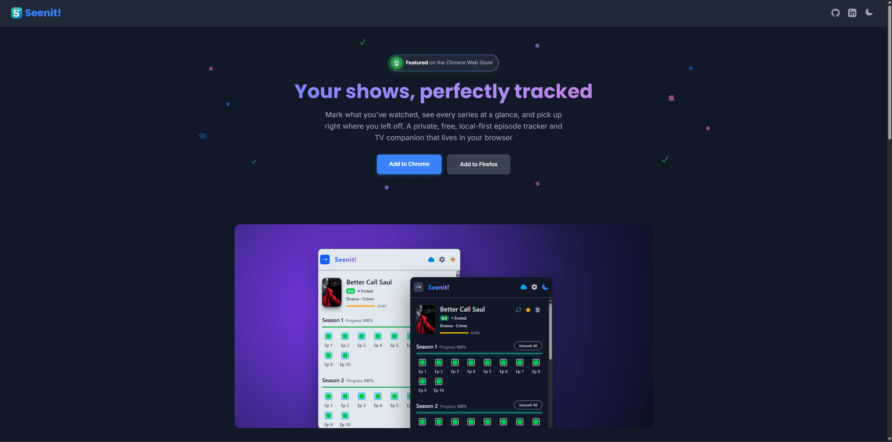

## Seenit! Episode Tracker

Never lose your place in a TV series again. Seenit! is a free browser extension that lets you track watched episodes, manage your shows, and always know what to watch next.

[Install Seenit! for the Chrome](https://chromewebstore.google.com/detail/seenit-episode-tracker/amopmnmnaimidbcfnjbnlfagmlmdhlch)

[Install Seenit! for the Firefox](https://addons.mozilla.org/ru/firefox/addon/seenit-episode-tracker/)

### Why Seenit!?

- Mark episodes as watched with a click and see your progress for every season.
- Search, add, favorite, filter, and reorder the shows in your personal watchlist.
- Keep watch history private and local by default, with no account, ads, or tracking.
- Optionally back up and sync progress through your own Google Drive on Chrome.
- Use a clean, fast interface in either dark or light mode.

This repository contains the landing page for the Seenit! Episode Tracker browser extension.

  

